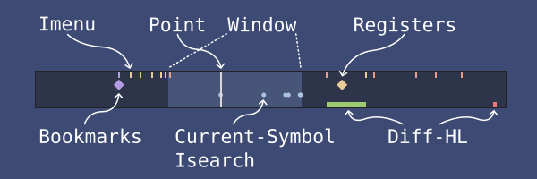

#+title: poimap.el - Visual buffer map with points of interest
#+author: Florian Rommel
#+email: mail@florommel.de
#+language: en

Poimap is a visual (SVG-based) buffer map for the Emacs mode line. In addition
to standard scroll-bar-like features (showing the currently visible portion of
the buffer and the position of the point), Poimap displays configurable points
or regions of interest (POIs) as colored marks/symbols (similar to a video-game
minimap), providing an immediate overview of not only your position but also the
buffer's topology.

POIs can for example be search matches, bookmarks, registers, diagnostics,
changed lines, imenu items, and in principle anything else that has a buffer
position.

Poimap was inspired by [[https://github.com/jdtsmith/mlscroll][mscroll]] and [[https://github.com/TeMPOraL/nyan-mode][nyan-mode]]. In contrast to these packages,
poimap uses a more powerful (but heavier) SVG rendering method which enables the
display of arbitrary POI markers.

* Disclaimer

Poimap is work in progress and not yet stable. It is usable today, but expect
rough edges and breaking changes. Poimap is currently only tested on Emacs 30
(pgtk). If you use a different setup, feel free to report your experience. Of
course, other feedback, ideas, and contributions are also welcome.

* Example

[[https://github.com/user-attachments/assets/19697576-b639-4ba3-b2f3-f28994bffdcb]]

This is Poimap with the [[https://github.com/florommel/hannover-theme][Hannover Night Theme]] and roughly this config:
#+BEGIN_SRC emacs-lisp
  (require 'poimap)
  (setq poimap-height 1.35)
  (setq poimap-width 0.38)
  (require 'poimap-bm)
  (setq poimap-bm-vertical-position 0.37)
  (poimap-bm 1)
  (require 'poimap-bookmark)
  (setq poimap-bookmark-vertical-position 0.37)
  (poimap-bookmark 1)
  (require 'poimap-current-symbol)
  (setq poimap-current-symbol-vertical-position 0.65)
  (poimap-current-symbol 1)
  (require 'poimap-diff-hl)
  (poimap-diff-hl 1)
  (require 'poimap-flymake)
  (setq poimap-flymake-vertical-position 0.37)
  (poimap-flymake 1)
  (require 'poimap-imenu)
  (poimap-imenu 1)
  (require 'poimap-isearch)
  (setq poimap-isearch-vertical-position 0.65)
  (poimap-isearch 1)
  (require 'poimap-register)
  (setq poimap-register-vertical-position 0.37)
  (poimap-register 1)
  (require 'poimap-swiper)
  (setq poimap-swiper-vertical-position 0.65)
  (poimap-swiper 1)
  (poimap-mode 1)
#+END_SRC

* Requirements

- Emacs 29.1 or later, tested with Emacs 30 (pgtk)
- A graphical Emacs build with SVG image support

Poimap cannot display its map in a terminal frame. You can check SVG support via:
#+BEGIN_SRC emacs-lisp
  (image-type-available-p 'svg)
#+END_SRC

* Installation

Poimap is not yet available from a package archive. Clone the repository and add
it to the ~load-path~:
#+BEGIN_SRC bash
  git clone https://github.com/florommel/poimap.git ~/.emacs.d/poimap
#+END_SRC
#+BEGIN_SRC emacs-lisp
  (add-to-list 'load-path (expand-file-name "poimap" user-emacs-directory))
  (require 'poimap)
#+END_SRC

Or with ~use-package~:
#+BEGIN_SRC emacs-lisp
  (use-package poimap
    :load-path "~/.emacs.d/poimap"
    :config
    (poimap-mode 1))
#+END_SRC

Or directly via ~:vc~ (no need to clone or add it to the load path manually):
#+BEGIN_SRC emacs-lisp
  (use-package poimap
    :vc (:url "https://github.com/florommel/poimap"
              :rev :newest)
    :config
    (poimap-mode 1))
#+END_SRC

The ~bm~, ~diff-hl~, and ~swiper~ integrations require their corresponding third-party
packages. The other integrations use built-in Emacs libraries.

* POI providers

By default poimap only displays the point and visisble window. Every POI
provider is optional. Require its library and enable its global minor mode.

| Library/Mode          | What it displays                       | Dependency |
|-----------------------+----------------------------------------+------------|
| poimap-bookmark       | Emacs bookmarks                        | --         |
| poimap-bm             | Bookmarks created by bm                | bm         |
| poimap-current-symbol | Occurrences of the symbol at point     | --         |
| poimap-diff-hl        | Inserted, changed, and deleted regions | diff-hl    |
| poimap-flymake        | Flymake errors, warnings, notes        | --         |
| poimap-imenu          | Imenu items                            | --         |
| poimap-isearch        | Matches during an active Isearch       | --         |
| poimap-register       | Position and file-position registers   | --         |
| poimap-swiper         | Candidates in a swiper session         | swiper     |

For example:
#+BEGIN_SRC emacs-lisp
  (require 'poimap-imenu)
  (require 'poimap-current-symbol)
  (require 'poimap-isearch)
  (require 'poimap-diff-hl)
  (poimap-imenu 1)
  (poimap-current-symbol 1)
  (poimap-isearch 1)
  (poimap-diff-hl 1)
#+END_SRC

Each provider has its own face, shape, size, and position options.

Enable the POI provider minor modes after the main ~poimap-mode~.

You can of course also write your own POI provider. It's not complicated. Have a
look at the existing providers.

* Configuration

** Size and placement

~poimap-width~ accepts a pixel count, a fraction of the window width, or a
function returning a pixel count. ~poimap-height~ similarly accepts a pixel
count, a multiple of the line height, or a function.
#+BEGIN_SRC emacs-lisp
  (setq poimap-width 0.25)     ; 25% of the window width
  (setq poimap-height 1.0)     ; default mode-line height
  (setq poimap-align-right t)  ; align to the right edge
#+END_SRC

Set ~poimap-align-right~ to nil if your mode-line format already controls
placement.

Increasing ~poimap-height~ gives you more vertical room to distribute the POI
types and works especially well with themes that use a taller mode line.

** Custom mode lines

If your mode-line does not display ~global-mode-string~, place the map explicitly.
Disable automatic insertion before enabling the mode:
#+BEGIN_SRC emacs-lisp
  (setq poimap-add-to-mode-line nil)
  (poimap-mode 1)
#+END_SRC

Add something like this at the desired position in ~mode-line-format~:
#+BEGIN_SRC emacs-lisp
  '(:eval (poimap-string))
#+END_SRC

** Appearance

Poimap displays rich information in the mode line in a colorful way. Without
additional configuration, it uses colors inherited from standard faces.
Depending on the theme, this may result in unfavorable color combinations
(usually due to the mode-line background). Customization may therefore be
necessary.

The main faces are:

- ~poimap-background-face~ and ~poimap-background-inactive-face~
- ~poimap-visible-window-face~ and
  ~poimap-visible-window-inactive-face~
- ~poimap-border-face~
- ~poimap-point-face~
- ~poimap-face~ and ~poimap-inactive-face~, used as the surrounding
  mode-line faces when ~poimap-use-face~ is non-nil

The SVG takes background colors from the background-related faces and the point
color from the foreground of ~poimap-point-face~. Corresponding ~poimap-*-alpha~
variables control (SVG) opacity. Marker dimensions can be adjusted with
~poimap-border-width~, ~poimap-point-width~, and ~poimap-min-range-size~.

Example:
#+BEGIN_SRC emacs-lisp
  (set-face-attribute 'poimap-point-face nil :foreground "orange")
  (setq poimap-background-alpha 0.35
        poimap-border-width 0
        poimap-point-width 2)
#+END_SRC

Changing themes automatically refreshes maps in visible windows. After changing
the appearance programmatically, call ~poimap-update-all~ to immediately refresh
all maps.

** Configuring a POI provider

POI provider options follow a more or less consistent naming scheme. This
example changes Flymake markers and includes every diagnostic severity:
#+BEGIN_SRC emacs-lisp
  (setq poimap-flymake-shape-function #'poimap-xcross
        poimap-flymake-size '(6 . 6)
        poimap-flymake-vertical-position 0.5
        poimap-flymake-include-filter nil)
  (set-face-attribute 'poimap-flymake-error-face nil :foreground "red")
#+END_SRC

Built-in point shapes are ~poimap-ellipse~, ~poimap-diamond~, ~poimap-xcross~, and
~poimap-tick~. ~poimap-range~ draws a horizontal line. Shape functions receive a
mapped position, vertical position, size, and a SVG color.

* Design and Performance

Poimap provides a live-updated buffer map with potentially hundreds or even
thousands of markers (think of isearch). Some effort has gone into the design
and performance optimization. There are basically two conflicting requirements:
keeping the map up to date and maintaining Emacs's responsiveness (especially
while scrolling).

Poimap uses a two-stage SVG rendering approach: The map's point marker and
visible-window rectangle are updated eagerly so that they closely follow
scrolling and movement. Luckily, these elements are cheap to recalculate. They
are refreshed on each mode-line update to show the most recent state of the
window. (Under input pressure, an additional rate-limiting mechanisms may skip
some recalculations.)

The POIs are more expensive to gather and render, but they also change less
frequently, and they are only tied to the buffer (not to the window/buffer
combination as the point and the visible window region). Poimap caches them on a
per-POI-provider basis for each buffer as prerendered SVG fragments. During the
mode-line update, Poimap then simply composes the (always recalculated)
point/window markers and the cached SVG fragments into the final SVG string.

Updating the prerendered POI caches is the responsibility of the respective POI
providers. Poimap exposes an idle-timer-based update mechanism, but providers
may also hook into relevant events or implement other custom update mechanisms.

In the SVG itself, the (horizontal) POI position is stored as a relative SVG
coordinate (i.e., a percentage value). This frees POI providers from having to
care about the final map width and allows Poimap to resize the map without
having to call the providers again.

However, there are cases that require re-rendering all cached POI SVG fragments,
independently of POI-related events. A buffer text change, for example, can
affect the relative position of every POI, even if the POI itself was not
modified: Inserting or deleting text changes the relative position of a
following or even preceding (e.g.) bookmark POI in the buffer although the
bookmark itself was not modified. To handle this, Poimap can trigger a forced
re-rendering for each active POI provider. This is relatively expensive, but is
performed in a delayed and debounced way for frequent events such as text
changes.

Poimap does not use Emacs's integrated SVG library, which utilizes an
intermediate DOM and renders it via a temporary buffer. Instead, Poimap provides
its own functions/macros that directly produce concatenatable SVG fragment
strings.

Despite all this, a large number of POIs can still negatively affect
performance, especially while scrolling. If you experience performance problems,
you may want to try the [[https://github.com/jdtsmith/ultra-scroll][ultra-scroll]] package. Among other things, it raises
Emacs's GC limits while scrolling, which can also improve Poimap's performance.
